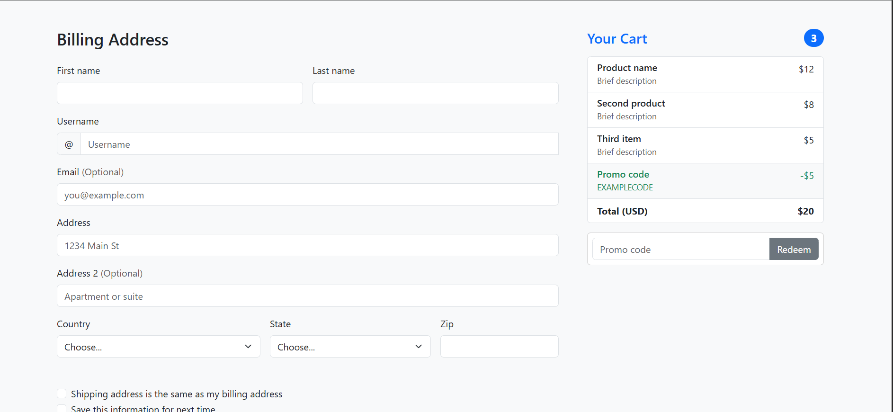
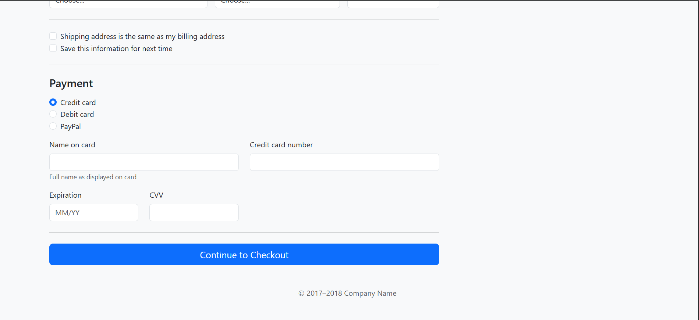

# 🛒 Checkout Form Using HTML

> A clean, responsive, and well-structured checkout form built using only HTML5.

---

## 📸 Project Preview

<p align="center">
  
</p>

<p align="center">
  
</p>
---

## 🚀 Live Demo

🔗 **Live Website:**  
https://joni250.github.io/checkout-form-html/

---

## 📂 Repository

🔗 **GitHub Repository:**  
https://github.com/Joni250/checkout-form-html

---

## ✨ Features

- ✅ Clean and responsive layout
- ✅ Semantic HTML5 structure
- ✅ Customer information form
- ✅ Billing address section
- ✅ Payment details section
- ✅ Organized input fields
- ✅ Beginner-friendly project
- ✅ Simple and user-friendly interface

---

## 🛠️ Technologies Used

| Technology | Purpose |
|------------|---------|
| HTML5 | Structure and checkout form layout |

---

## 📁 Project Structure

```text
checkout-form-html/
│── index.html
│── preview.png
│── README.md
```

---

## 🎯 Project Purpose

This project was created to practice HTML form design by building a structured checkout page. It demonstrates how to organize customer details, billing information, and payment fields using semantic HTML elements.

---

## 💡 What I Learned

- HTML5 Structure
- Semantic HTML Elements
- Form Design
- Input Fields
- Labels & Fieldsets
- Clean Code Organization

---

## 👩‍💻 Author

** Mst Joni Khatun**

Aspiring Frontend & WordPress Developer

GitHub:  
https://github.com/Joni250

---

## ⭐ Support

If you found this project helpful, please consider giving it a ⭐ on GitHub.
